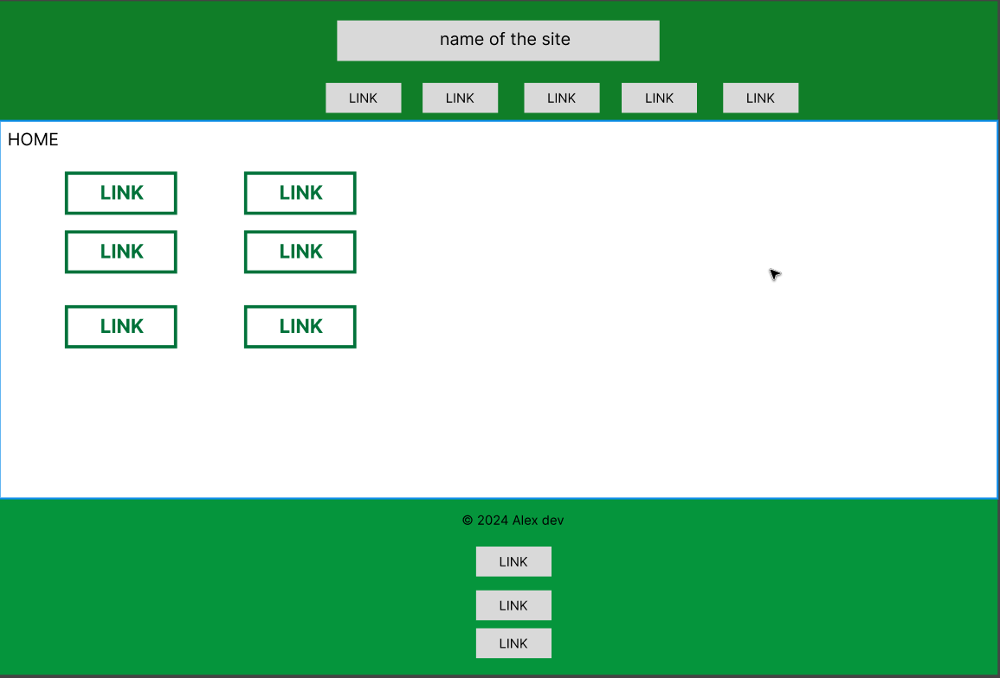
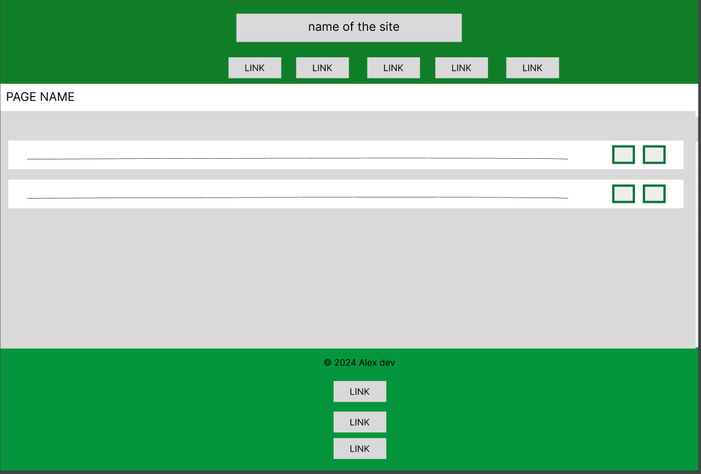
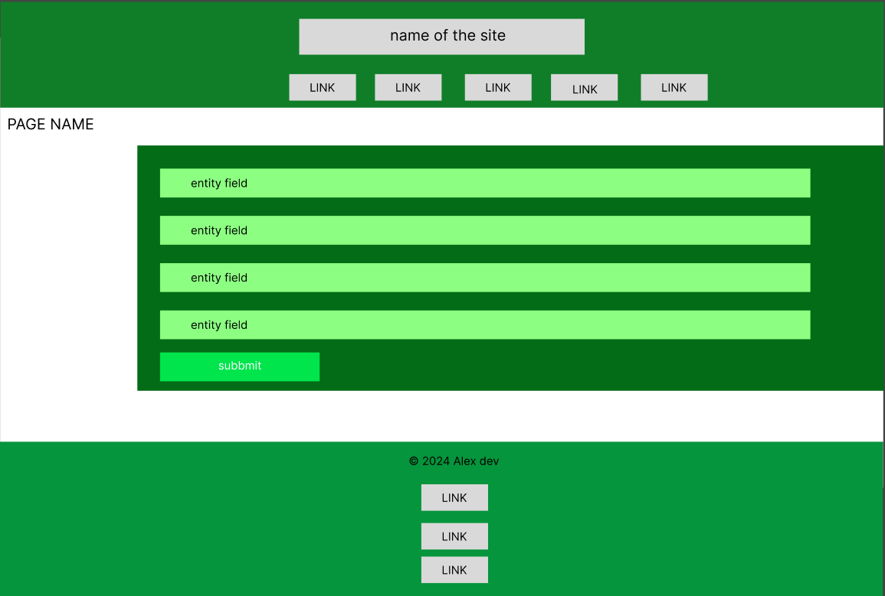
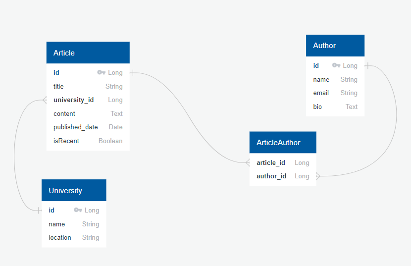

## University Publications Management System

### Functional Requirements

1. Manage Articles: Add, view, update, and delete article details.
2. Manage Authors: Add, view, update, and delete author details.
3. Manage Universities: Add, view, update, and delete university details.
4. View All Articles: Display a list of all articles in the system.
5. View All Authors: Display a list of all authors.
6. View All Universities: Display a list of all universities.
7. Secure Login: Implement a secure login system to restrict access.
8. Daily Article Update: Automatically update article `isRecent` status when it is older than 2 weeks.
9. Modify Article Information: Update any information about an article.
10. Modify Author Information: Update any information about an author.
11. Modify University Information: Update any information about a university.
12. Delete Article: Remove an article from the system.
13. Delete Author: Remove an author from the system.
14. Delete University: Remove a university from the system.

### REST API Endpoints

- **Articles**
  - `GET /articles` - Retrieve all articles
  - `GET /articles/{id}` - Retrieve a specific article by its id
  - `POST /articles` - Create a new article
  - `PUT /articles/{id}` - Update a specific article by its id
  - `DELETE /articles/{id}` - Delete a specific article by its id
- **Authors**
  - `GET /authors` - Retrieve all authors
  - `GET /authors/{id}` - Retrieve a specific author by its id
  - `POST /authors` - Create a new author
  - `PUT /authors/{id}` - Update a specific author by its id
  - `DELETE /authors/{id}` - Delete a specific author by its id
- **Universities**
  - `GET /universities` - Retrieve all universities
  - `GET /universities/{id}` - Retrieve a specific university by its id
  - `POST /universities` - Create a new university
  - `PUT /universities/{id}` - Update a specific university by its id
  - `DELETE /universities/{id}` - Delete a specific university by its id

### Web UI Pages (Server Side Rendering)

1. Home
2. List Articles
3. Article Details
4. List Authors
5. Author Details
6. List Universities
7. University Details

### Mockups

In addition to the main page, each entity has a list page and a details (editing) page. Here are rough designs for them:

- Home Page: 
- List Page: 
- Edit Entity Page: 

### ERD

s ERD using the following link: [Quick Database Diagrams](https://app.quickdatabasediagrams.com/#/)